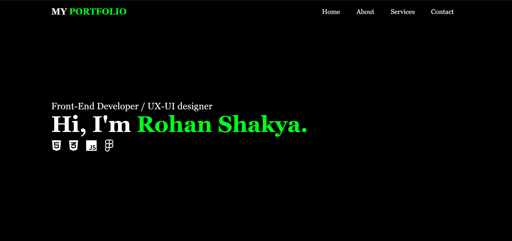
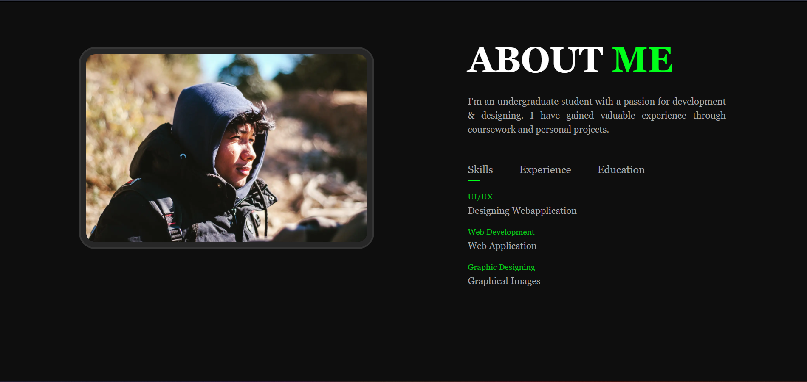
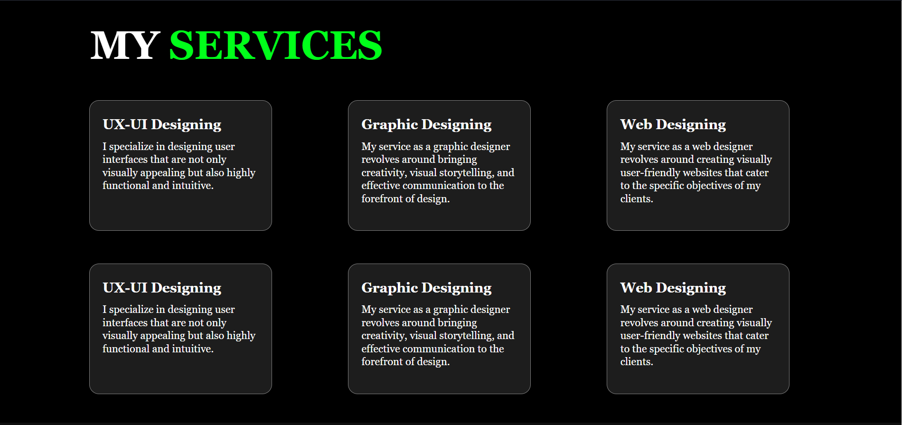
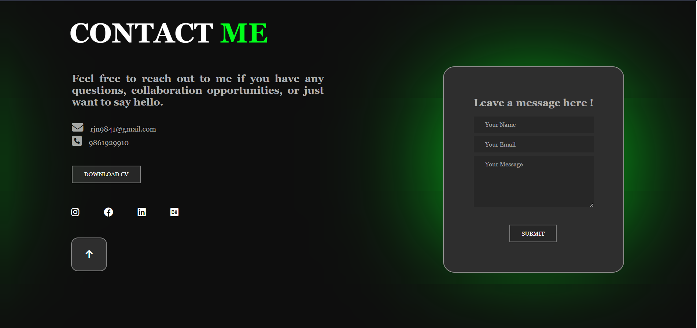

# My Portfolio

This is a Portfolio website built using HTML, CSS and JS. 

## Description

This website is built to develop my technical and webdesigning skills. I learned how to build a responsive webpage after completing this project.
## Technologies Used
1. (HTML5)[https://www.w3schools.com/html/]
2. (CSS3)[https://www.w3schools.com/css/default.asp]
3. (JS(ES6))[https://www.w3schools.com/js/default.asp]
4. (Git)[https://www.w3schools.com/git/default.asp]
5. (GitHub)[https://github.com/]
6. (Figma)[https://figma.com/]

## Webpage Visuals

